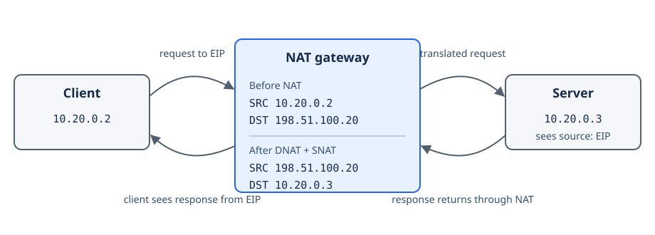

# Hairpin NAT

Hairpin NAT lets a workload reach another workload through its Elastic IP (EIP), even when both workloads are on the private network. This is also known as NAT loopback.

Without hairpin NAT, traffic sent to the EIP may leave the private network or fail to return through the same NAT gateway. Applications then need different internal and external addresses for the same service.

Superphenix supports hairpin NAT. When a private client connects to an EIP, the NAT gateway:

1. Replaces the destination EIP with the private IP of the target workload (**DNAT**).
2. Replaces the client's private source IP with that same EIP (**SNAT**).

The source translation forces the response back through the NAT gateway, which reverses both translations and returns the response to the client.

In this example:

- The client at `10.20.0.2` connects to the service EIP `198.51.100.20`.
- The NAT gateway changes the destination to the server's private IP, `10.20.0.3`.
- The NAT gateway also changes the source from `10.20.0.2` to `198.51.100.20`.
- The server therefore sees a connection from `198.51.100.20`, not from the client's private IP.
- The client continues to see `198.51.100.20` as the service address.

!!! note "Preserving the client address"
    Because hairpin NAT translates the source address, the target workload cannot use the packet's source IP to identify the original client. If the application needs that identity, pass it at the application layer or use the private service address directly.

Hairpin NAT applies to both one-to-one EIP mappings and ports exposed with DNAT rules. The EIP and its destination must already be configured on the subnet's NAT gateway.
