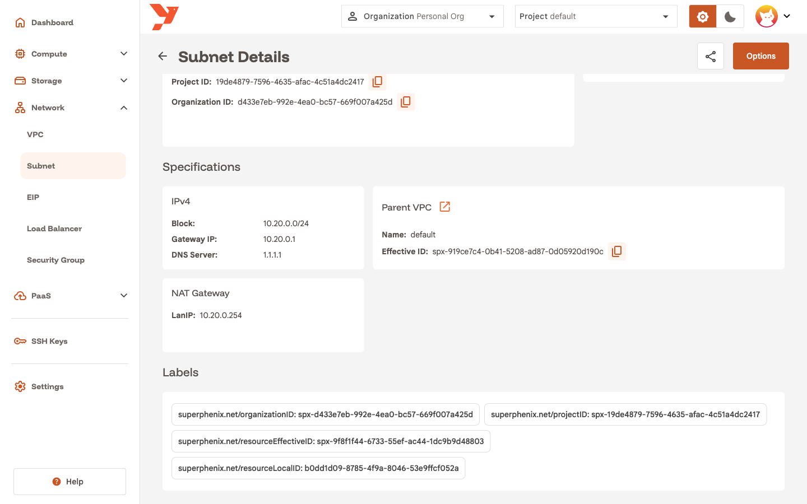
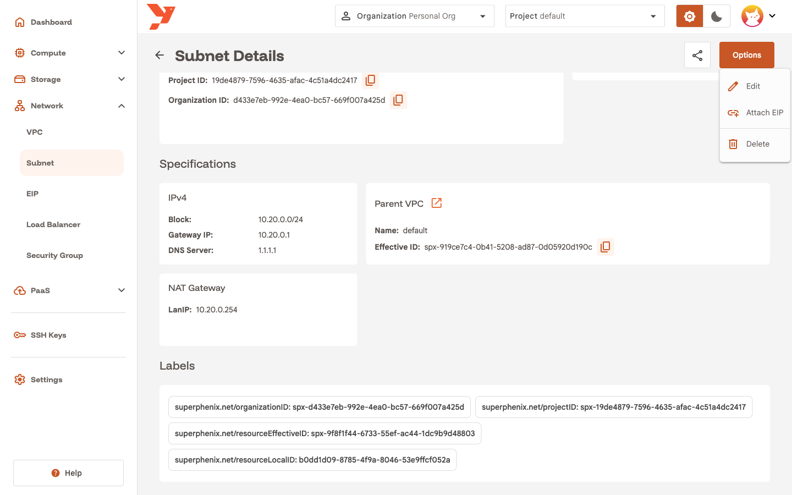
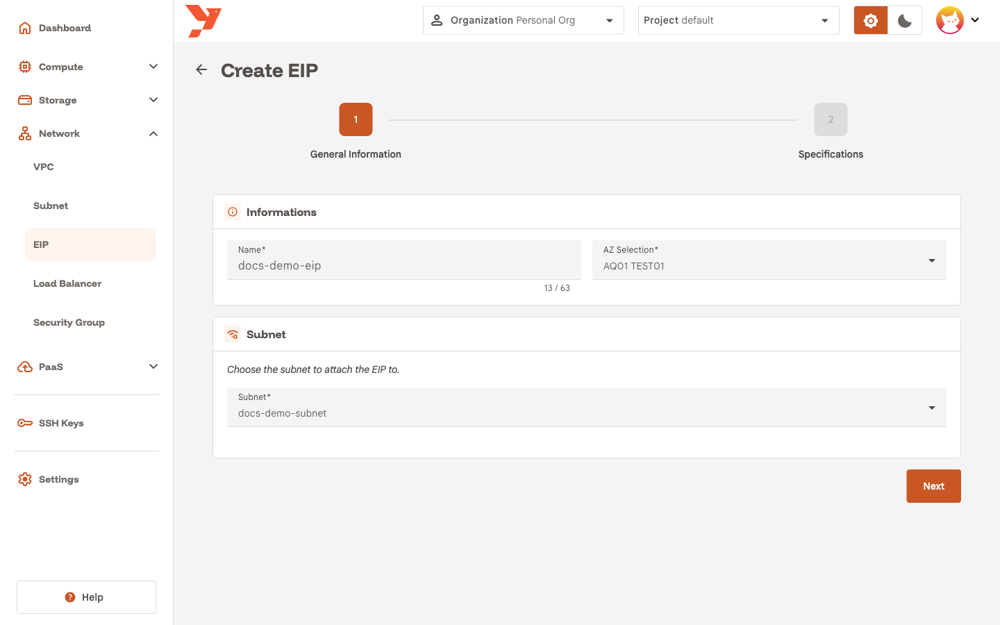
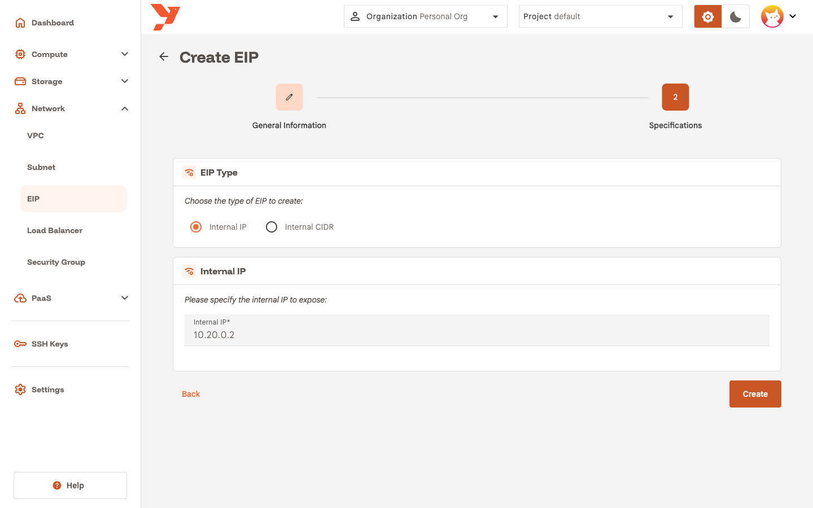
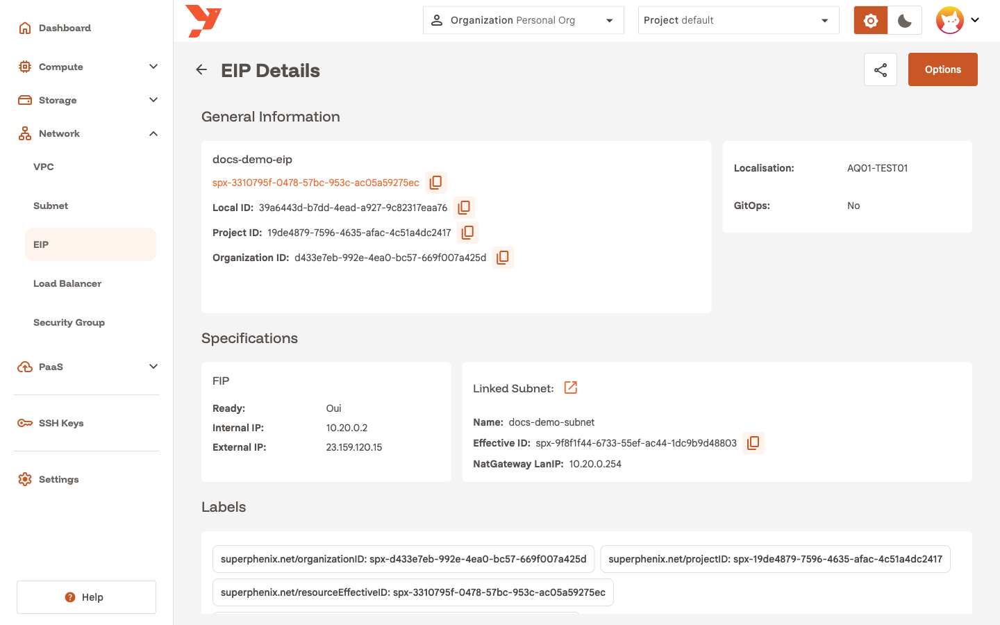
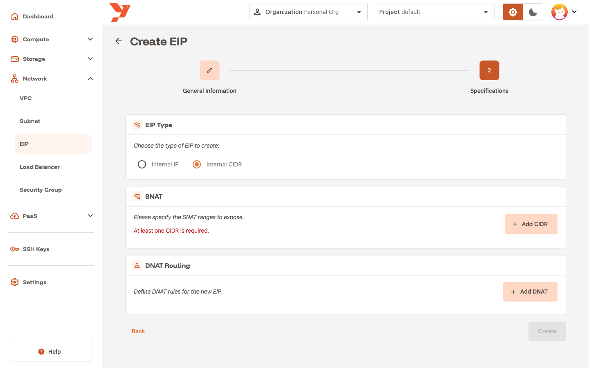

# Expose a VM with an Elastic IP

An Elastic IP (EIP) is a public IPv4 address that the platform maps to a private address in one of your subnets. This guide gives the VM from [Create a virtual machine](create-a-vm.md) a public IP and checks it with SSH.

## Prerequisites

- A running VM with a known **Assigned IP**. The guide uses `docs-demo-vm` at `10.20.0.2`.
- A subnet with a **NAT gateway**. EIPs attach to the gateway, so a subnet without one does not appear in the EIP wizard.

### Enable the NAT gateway on a subnet

You choose this when you create the subnet, with the **Enable NAT gateway** checkbox, or later from the subnet details page with **Options → Edit**. [Create a subnet with a NAT gateway](../network/create-a-subnet.md) walks through the wizard and explains the options. The guide's VM runs on `docs-demo-subnet`, created that way.

To check an existing subnet, open its details page. A subnet with a gateway shows a **NAT Gateway** card with the gateway's **LanIP**.



## Create the EIP

1. On the subnet details page, open **Options** and click **Attach EIP**. The EIP wizard opens with the AZ and subnet already selected. You can also start from **Network → EIP → Create an EIP** and pick the subnet yourself.

    

2. Enter a **Name**, for example `docs-demo-eip`, and click **Next**.

    

3. Keep **EIP Type** on **Internal IP** and enter the VM's **Assigned IP** in **Internal IP**.

    

4. Click **Create**.

**Internal IP** mode is a one-to-one NAT. Every port of the public address reaches the same port on the VM, and the VM's outbound traffic leaves with that public address.

## Read the public address

The console opens the EIP details page. The **FIP** card shows **Ready**, the **Internal IP** you entered, and the **External IP** the platform allocated. Reload the page if **Ready** still reads no. Allocation takes a few seconds.



The **Network → EIP** list shows the same address in its **Public IP** column.

## Test the connection

From your workstation, check that the SSH port answers:

```bash
nc -zv <External IP> 22
```

Then log in as the default user:

```bash
ssh spx@<External IP>
```

Use the key you selected in the wizard, or the generated password from the instance's **Storage** tab. Ubuntu asks you to change the password on the first login.

## Alternative: Internal CIDR with DNAT

Pick **Internal CIDR** in step 3 when you want one public address for a whole range, or when you want to publish only specific ports.



- **SNAT**: click **Add CIDR** and enter the private ranges that leave through this public address. The form needs at least one CIDR. This gives the VMs outbound Internet access and nothing more.
- **DNAT Routing**: click **Add DNAT** for each port you publish. A rule maps an **External port** on the public address to an **Internal IP** and **Internal Port**, for the chosen **Protocol**.

Without DNAT rules, an Internal CIDR EIP opens no inbound port.

## Notes

- One NAT gateway serves one subnet. Two VMs on the same subnet can each have their own EIP.
- Security groups apply on top of the EIP. When no security group targets the VM, all traffic passes. See [Create a security group](../network/create-a-security-group.md) to filter it, and [Network](../../features/network.md) for the concepts.
- Deleting the EIP releases the public address. The VM keeps its private IP and stays up.
